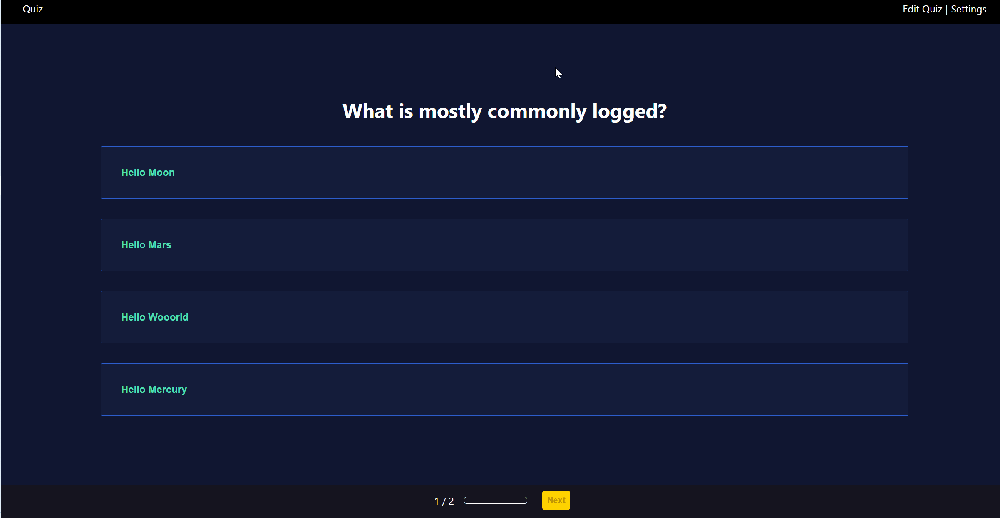

 Fullstack Next.js Quiz App with SQLite3 database
================

A comprehensive quiz application built with React, Next.js, and Redux-like state management.

This app highlights my ability to:
* Build complex applications with React and Next.js
* Implement Redux-like state management
* Write clean, modular, and testable code
* Use Jest and React Testing Library for testing
* Utilize CSS Modules for styling and layout

 Table of Contents
-----------------

* [Features](#features)
* [Technologies Used](#technologies-used)
* [Clean Code Techniques](#clean-code-techniques)
* [Getting Started](#getting-started)
* [Usage](#usage)
* [Testing](#testing)

 Features
------------

* Quiz questions with multiple answers
* User can select answers and track progress
* Summary page with correct and incorrect answers
* Settings page for customization

Technologies Used
--------------------

* **React**: For building reusable UI components
* **Next.js**: For server-side rendering and routing
* **Redux-like state management**: For managing global state
* **Jest and React Testing Library**: For unit testing
* **CSS Modules**: For styling and layout
* **SQLite3 database**: For storing quiz data
* **Custom Hooks**: For managing data fetching and state updates, promoting code reusability and modularity. 
* **Prisma (ORM tool)**: For interacting with the database, providing a powerful and flexible way to define the database schema and perform 
  CRUD operations.

 Clean Code Techniques
-----------------------

* **Separation of Concerns (SoC)**: Each component has a single responsibility
* **Single Source of Truth (SSOT)**: State is managed centrally and updated predictably
* **Functional Programming**: Components are written as pure functions where possible
* **Type Safety**: TypeScript is used to ensure type safety and catch errors early

 Getting Started
-------------------

1. Clone the repository: `git clone https://github.com/your-username/quiz-app.git`
2. Install dependencies: `npm install` or `yarn install`
3. Start the development server: `npm run dev` or `yarn dev`

Usage
---------

1. Open the app in your browser: `http://localhost:3000`
2. Select answers to quiz questions
3. View summary page with correct and incorrect answers
4. Customize settings on the settings page

 Testing
------------

1. Run unit tests: `npm run test` or `yarn test`

